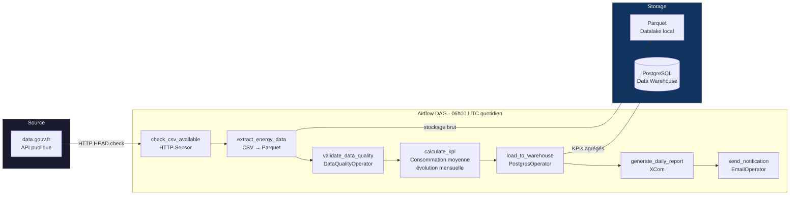

# Energy Data Pipeline


Pipeline batch quotidien d'ingestion et de contrôle qualité des données de
consommation énergétique française (source : data.gouv.fr). Orchestré par
Apache Airflow avec CeleryExecutor — opérateur custom de data quality inclus.

---

## Pipeline



---

## Stack technique

| Composant | Technologie | Rôle |
|---|---|---|
| Orchestration | Apache Airflow 2.7 + CeleryExecutor | Scheduling, retry, monitoring des tâches |
| Message broker | Redis 7 | Queue des tâches Celery |
| Data warehouse | PostgreSQL 14 | Stockage des KPIs agrégés |
| Stockage brut | Parquet (local) | Données brutes horodatées par exécution |
| Data quality | `DataQualityOperator` custom | Contrôle nulls, types, doublons, seuil 95% |
| Monitoring Celery | Flower | Supervision des workers en temps réel |
| Admin BDD | pgAdmin 4 | Interface PostgreSQL |

---

## Fonctionnalités

**Extraction** — Télécharge quotidiennement le dataset de consommation
énergétique depuis l'API data.gouv.fr et le convertit en Parquet horodaté
(`energy_data_YYYY-MM-DD.parquet`).

**Data Quality** — `DataQualityOperator` vérifie 4 règles sur chaque fichier :
- Absence de valeurs nulles dans les colonnes critiques
- Cohérence des valeurs numériques (≥ 0)
- Format des dates valide
- Absence de doublons sur les colonnes critiques

Le pipeline échoue si moins de 95 % des lignes passent les contrôles.

**KPIs calculés** — Consommation moyenne par catégorie d'activité, évolution
mensuelle, classement des secteurs énergivores.

**Rapport quotidien** — Rapport d'exécution généré via XCom (durées par tâche,
nombre de lignes traitées, alertes) et envoyé par email.

---

## Structure du projet

```
energy-data-pipeline/
├── dags/
│   ├── energy_data_pipeline.py   # DAG principal (7 tâches)
│   └── config/
│       └── pipeline_config.yaml  # Paramètres du pipeline
├── plugins/
│   ├── operators/
│   │   └── data_quality_operator.py  # Opérateur custom Airflow
│   └── sensors/
│       └── api_sensor.py             # Sensor HTTP custom
├── postgres/
│   └── init.sql                  # Schéma initial du data warehouse
├── docker-compose.yml            # Stack complète (Airflow + Redis + PostgreSQL + pgAdmin)
├── requirements.txt
└── .env.example                  # Variables d'environnement à configurer
```

---

## Lancer le projet

### 1. Configurer l'environnement

```bash
cp .env.example .env
# Éditer .env avec vos valeurs
# Générer la FERNET_KEY :
python -c "from cryptography.fernet import Fernet; print(Fernet.generate_key().decode())"
```

### 2. Démarrer la stack

```bash
docker compose up -d
```

Initialisation (~30s) puis accès aux interfaces :

| Interface | URL | Credentials |
|---|---|---|
| Airflow UI | http://localhost:8080 | admin / admin |
| Flower (Celery) | http://localhost:5555 | — |
| pgAdmin | http://localhost:5050 | voir `.env` |
| PostgreSQL | localhost:5432 | voir `.env` |

### 3. Déclencher le DAG

Dans l'interface Airflow → DAGs → `energy_data_pipeline` → Enable + Trigger.

Ou via CLI :

```bash
docker exec airflow_scheduler airflow dags trigger energy_data_pipeline
```

### 4. Arrêter

```bash
docker compose down -v
```

---

## DataQualityOperator — opérateur custom

L'opérateur `DataQualityOperator` étend `BaseOperator` pour encapsuler
les contrôles qualité réutilisables entre DAGs.

```python
validate_data_quality = DataQualityOperator(
    task_id="validate_data_quality",
    input_path="/opt/airflow/datalake/raw_data/energy_data_{{ ds }}.parquet",
    critical_columns=["annee_consommation", "consommation_declaree"],
    numeric_columns=["surface_declaree", "consommation_declaree"],
    threshold=0.95   # échec si < 95% des lignes valides
)
```

`template_fields = ('input_path',)` permet à Airflow de résoudre
`{{ ds }}` (date d'exécution) dans le chemin du fichier.

---

## Architecture Airflow — CeleryExecutor

```
Airflow Scheduler  →  Redis (queue)  →  Celery Workers
                                              │
                                    exécutent les tâches Python
                                    (extract, validate, calculate...)
```

Le **CeleryExecutor** distribue les tâches sur plusieurs workers — contrairement
au `LocalExecutor` (single-node), il permet de scaler horizontalement en
ajoutant des workers sans toucher au scheduler.

---

## Licence

MIT — données publiques data.gouv.fr (Licence Ouverte 2.0).
